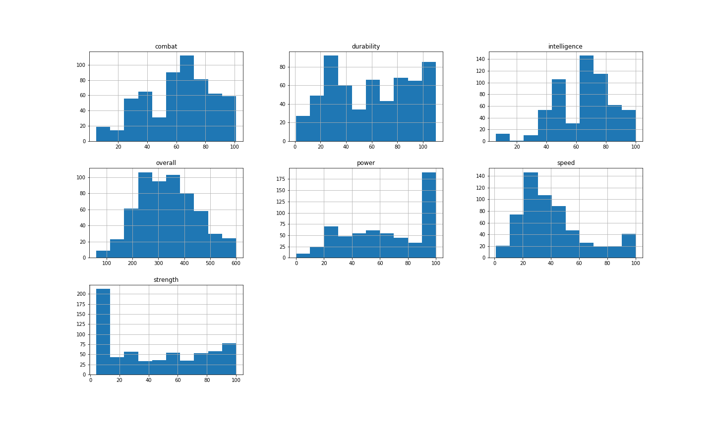
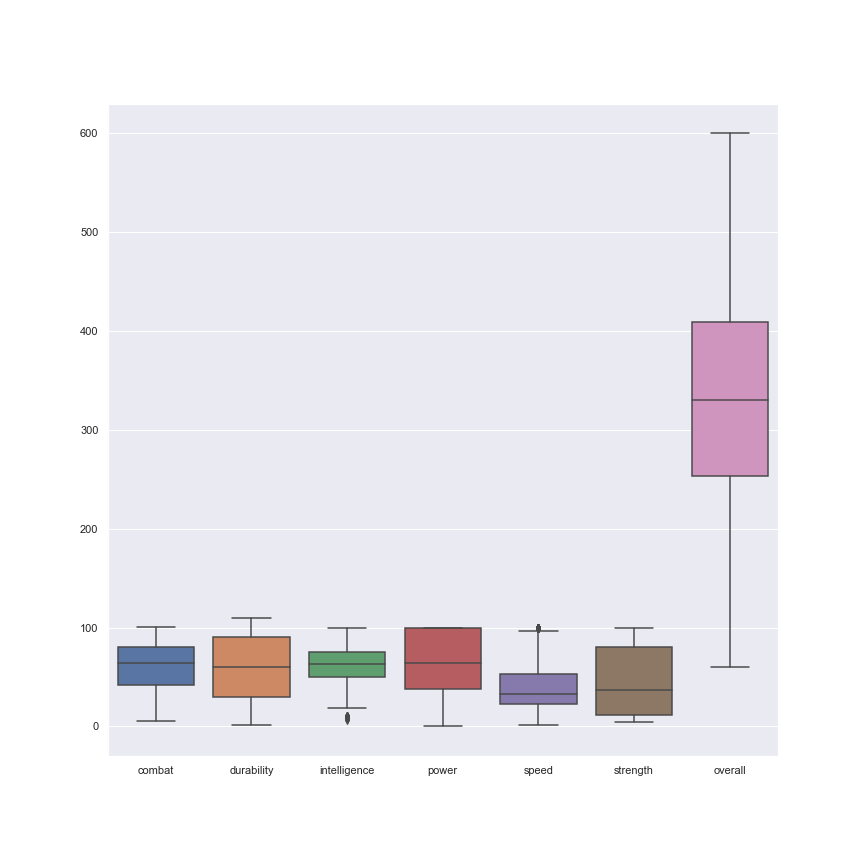
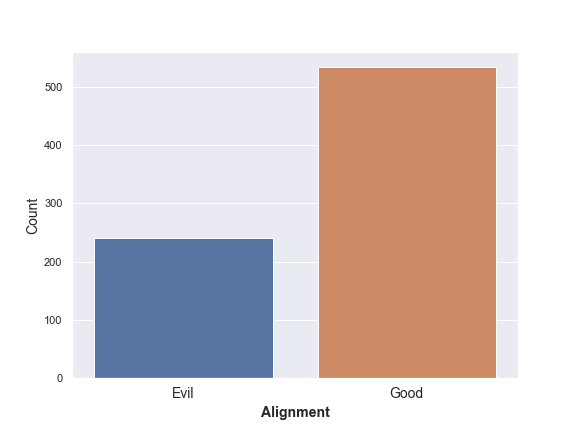
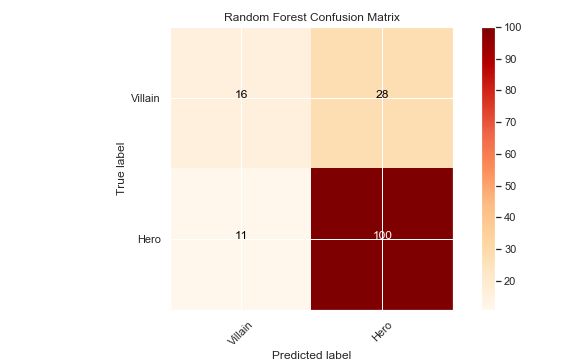
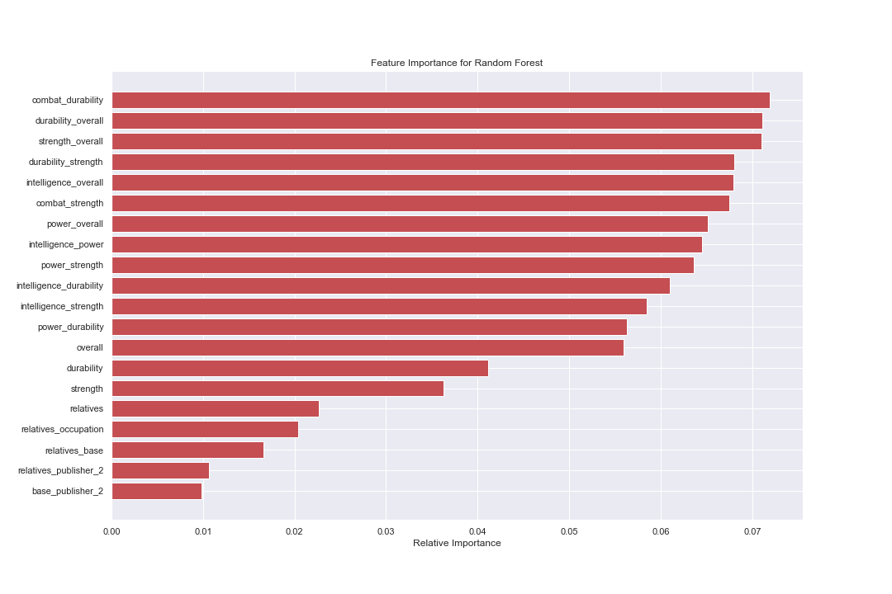
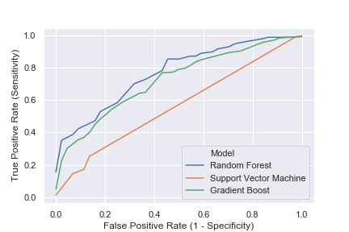

# Character_Classification

## Project Purpose and Description
The purpose of this project was to classify comic book characters as either good or evil based off features relating to their powerstats and identification. 

## Data
The Data for this project was scraped from the [Superhero API](https://superheroapi.com/).  Numerical Data from the powerstats category and categoral data such as the characters' biography, appearance, work, and connections were utilized.  

<ins> Features </ins>

Over 700 data points

combat, durability, intelligence, power, speed, strength, overall base, occupation, relatives, alter-egos

## Outcome

Initial Outcome  
Good: 69%  
Evil: 31%

  

##  Top Models Evaluation Accuracy Score 

Random Forest - 0.7484  
SVM - 0.7161  
GradientBoost - 0.7032  

## Confusion Matrix Metrics for Random Forest

Classification Accuracy - 0.7484  
Classification Error - 0.2516  
Recall - 0.9009  
Precision - 0.7273  
F1 Score - 0.8189

## Feature Importance for Random Forest

## ROC Curve

## Conclusion
After running several models and testing for the greatest F1 Score,  Adaboost classified the best.  Considering that the sample what relatively small and biased towards good, I would like to classify characters based off good and evil incorporating more features and also used SMOTE to deal with imbalanced classes.  

